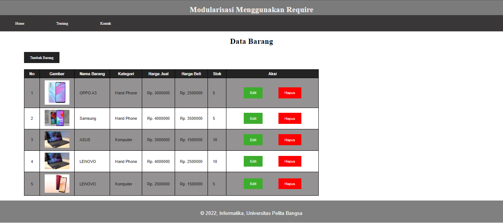
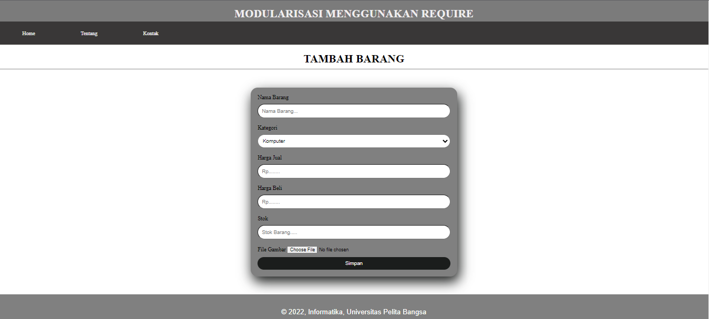
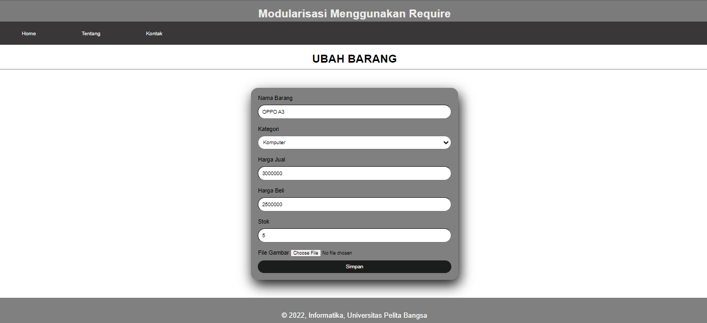

# Lab 9 PHP Modular

## Membuat File header.php

            <!DOCTYPE html>
            <html lang="en">

            <head>
              <meta charset="UTF-8">
              <meta http-equiv="X-UA-Compatible" content="IE=edge">
              <meta name="viewport" content="width=device-width, initial-scale=1.0">
              <title>Document</title>
              <link rel="stylesheet" href="style.css">
            </head>

            <body>
              

                <header>
                  <h1>Modularisasi Menggunakan Require</h1>
                </header>
                

                  <nav>
                    <a href="home.php">Home</a>
                    <a href="about.php">Tentang</a>
                    <a href="kontak.php">Kontak</a>
                  </nav>
                

              

            </body>

            </html>

## Membuat File footer.php

            <!DOCTYPE html>
            <html lang="en">

            <head>
              <meta charset="UTF-8">
              <meta http-equiv="X-UA-Compatible" content="IE=edge">
              <meta name="viewport" content="width=device-width, initial-scale=1.0">
              <title>Document</title>
              <link rel="stylesheet" href="style.css">
            </head>

            <body>
              <footer>
                
&copy; 2022, Informatika, Universitas Pelita Bangsa

              </footer>
            </body>

            </html>

## Membuat File home.php

<?php require('header.php'); ?>

            <!DOCTYPE html>
            <html lang="en">
            <head>
              <meta charset="UTF-8">
              <meta http-equiv="X-UA-Compatible" content="IE=edge">
              <meta name="viewport" content="width=device-width, initial-scale=1.0">
              <title>Document</title>
              <link rel="stylesheet" href="style.css">
            </head>
            <body>
              

                <h2>Ini Halam Home</h2>
                
Ini adalah bagian content dari halaman.

              

  
              <?php require('footer.php'); ?>
  
            </body>
            </html>

## Membuat File about.php

            <?php require('header.php') ?>

            <!DOCTYPE html>
            <html lang="en">

            <head>
              <meta charset="UTF-8">
              <meta http-equiv="X-UA-Compatible" content="IE=edge">
              <meta name="viewport" content="width=device-width, initial-scale=1.0">
              <title>Document</title>
            </head>

            <body>
              

                <h2>Ini Halaman About</h2>
                
Ini adalah bagian content dari halaman.

              

              <?php require('footer.php'); ?>

            </body>

            </html>

# Tugas 

      Pertanyaan dan Tugas
      Implementasikan konsep modularisasi pada kode program praktikum8  tentang
      database, sehingga setiap halamannya memiliki template tampilan yang  sama.

1. Tapilan Index

2. Tampilan Tambah Barang

3. Tampilan Ubah Barang

### Link Tugas Pratikum 10
https://github.com/kinje-29/Lab10Web